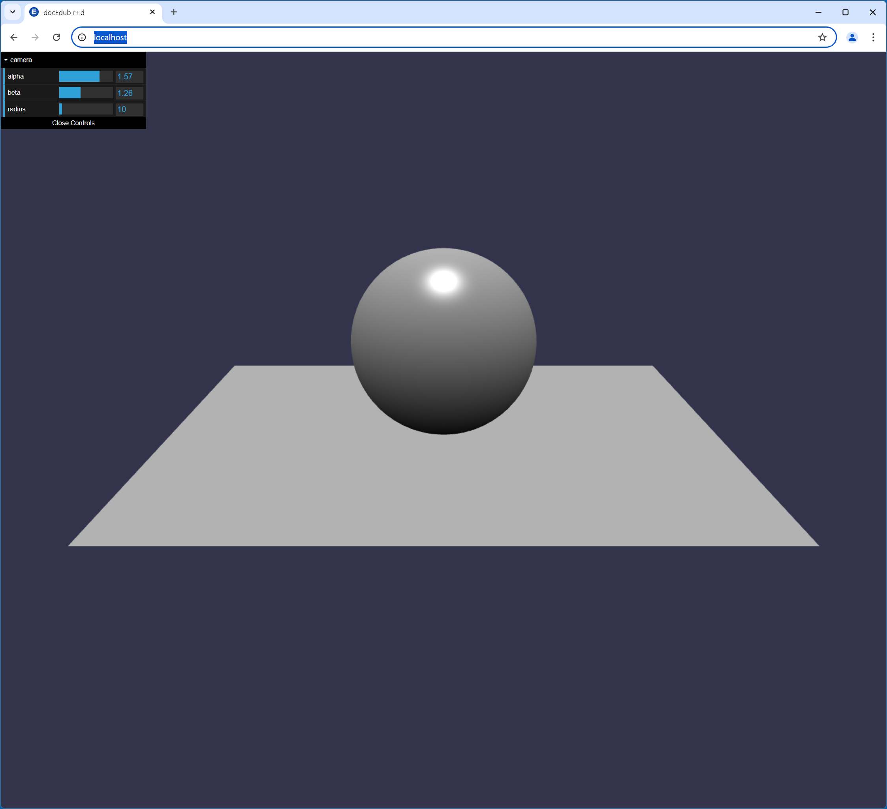

# Babylon.js Template

A template for getting started with Babylon.js and TypeScript in a live, hot-reloaded and debuggable local VS Code development environment similar to the [Babylon playground](https://playground.babylonjs.com/).



## Prerequisites

-   [Git](https://git-scm.com/downloads)
-   [Node.js](https://nodejs.org/en/download/prebuilt-installer)
-   [VS Code](https://code.visualstudio.com/)
-   [Chrome](https://www.google.com/chrome/browser-tools/)

## Getting started

1. Make sure Node.js is installed by running the following commands in a terminal:
   `node --version` and `npm --version`. You should see a version number displayed after each command is run.
1. Clone this repository to your local machine using Git and rename the directory to something other than "babylonjs-template".
1. In a terminal, `cd` to the cloned repository on your local machine and run `npm run boostrap` to install the base set of packages.
1. Open the cloned repository in VS Code and install the recommended extensions listed in `.vscode/extensions.json`.
1. In VS Code's "Run and Debug" view, make sure the `http` target is selected in the dropdown and press the button with the green arrow on it to start debugging. This should build the project using webpack and launch Chrome with the default Babylon.js scene loaded. It should look like the image at the top of this page:
1. Modify [src/playground.ts](./src/playground.ts) and save it. This should make webpack rebuild the project automatically, and reload the page in the browser.<br>
1. Create a new Github repository, then set it as the origin and push your changes to it with the following terminal commands:
    ```
    git remote set-url origin git@github.com:<your username>/<your repository's name>.git
    git add .
    git commit -m"Bootstrap Babylon.js template"
    git push
    ```
